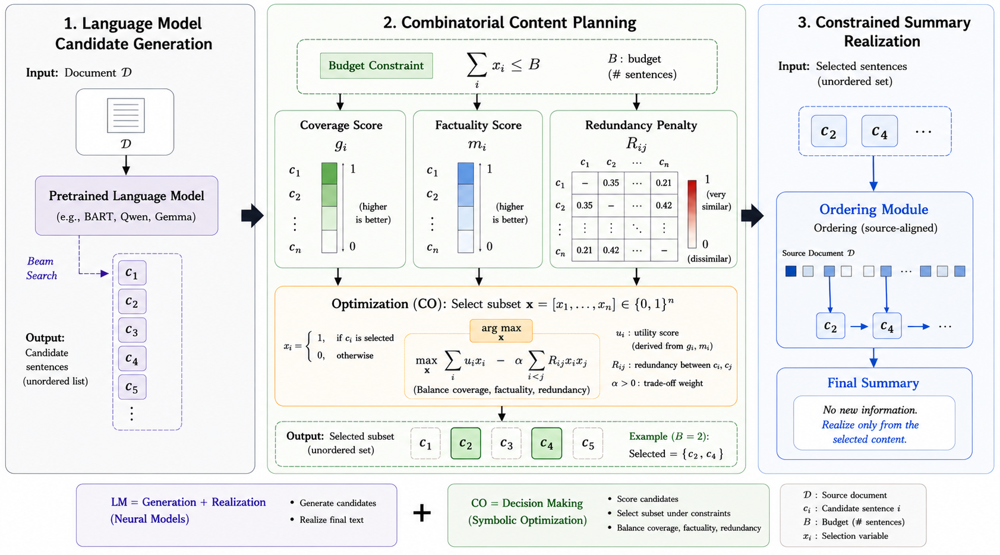

# Decoupling Generation and Selection for Budget-Constrained Faithful Summarization

[](https://arxiv.org/abs/2608.03655)
[](LICENSE)

Official implementation and reproducibility release for:

> **Decoupling Generation and Selection for Budget-Constrained Faithful Summarization**<br>
> Zeyu Wang, Guanghua Wang, and Meng Xu<br>
> Kean University<br>
> [Paper](https://arxiv.org/abs/2608.03655) · [PDF](https://arxiv.org/pdf/2608.03655) · [Results](results/paper/README.md) · [Reproduction guide](docs/reproducibility.md)

BCFS treats a pretrained summarizer as a candidate generator rather than the
final decision maker. It decomposes multiple generated summaries into a shared
sentence pool, scores candidates for coverage and factuality, suppresses
redundancy, and selects a sentence-budget-constrained subset using MMR, ILP, or
a DPP-inspired greedy log-determinant objective. The generator is not retrained
and the selected content is not rewritten.



## Highlights

- **Model-agnostic:** supports task-specific encoder-decoder models and
  instruction-tuned LLMs.
- **Explicit control:** selection is performed under a sentence-count budget.
- **Modular optimization:** MMR, ILP, and DPP-inspired selectors share the same
  candidate pool and scoring interface.
- **Evidence-first release:** published tables, compact raw result evidence,
  provenance metadata, and validation scripts are kept separate and labeled.

The paper reports a consistent trade-off: selection improves factuality and
source-grounding metrics, particularly on Multi-News, while reducing ROUGE and
BERTScore. Two CNN/DailyMail Llama metrics are non-significant after Holm
correction; see the full significance artifact. The following paired values are
copied from arXiv v1 Table 1; all metrics are percentages.

| Dataset / backbone | R-Lsum (Direct → +DPP) | MiniCheck (Direct → +DPP) | AlignScore (Direct → +DPP) | FaithLens (Direct → +DPP) |
| --- | ---: | ---: | ---: | ---: |
| CNN/DailyMail / BART | 41.05 → 36.30 | 94.96 → 97.73 | 91.55 → 94.63 | 98.02 → 99.63 |
| CNN/DailyMail / Llama-3-8B | 35.28 → 22.91 | 76.00 → 87.56 | 75.08 → 79.56 | 99.09 → 98.89 |
| Multi-News / PRIMERA | 37.30 → 32.79 | 63.06 → 85.38 | 53.30 → 71.27 | 64.46 → 79.70 |
| Multi-News / Llama-3-8B | 34.81 → 28.18 | 60.46 → 83.15 | 59.04 → 72.56 | 68.52 → 95.14 |

In the 100-example blind human evaluation, DPP-selected summaries were
preferred 61 times versus 26 preferences for direct generation, with 10 ties
and 3 uncertain judgments. Direct generation retained a small mean advantage
in coherence; see the [published human-evaluation artifact](results/paper/arxiv_v1_human_evaluation.csv)
for the complete values and protocol caveats.

## Repository Layout

```text
.
├── assets/                 # Paper figure used in this README
├── src/                    # One runnable pipeline per generator family
│   ├── bart/
│   ├── primera_multinews/
│   ├── llama3_8b/
│   ├── qwen3_5_9b/
│   └── gemma4_e4b/
├── scripts/                # Launch, table collection, and release validation
├── results/
│   ├── paper/              # Values transcribed from arXiv:2608.03655v1
│   ├── raw/                # Compact committed experiment logs
│   └── tables/             # Tables regenerated from results/raw
├── docs/                   # Reproduction, provenance, and code-paper mapping
├── survey/                 # Archived blind human-evaluation interface
├── worker/                 # Archived survey backend
├── environment.yml
└── requirements.txt
```

## Installation

Python 3.11 is the release target. CUDA, model weights, and dataset caches are
not bundled.

### Conda

```bash
git clone https://github.com/zy06-learn/bcfs.git
cd bcfs
conda env create -f environment.yml
conda activate bcfs
```

### venv

```bash
git clone https://github.com/zy06-learn/bcfs.git
cd bcfs
python3.11 -m venv .venv
source .venv/bin/activate
python -m pip install --upgrade pip
python -m pip install -r requirements.txt
```

Some factuality evaluators require separately downloaded checkpoints or local
repositories. Configure them with `NLM_ASSETS_DIR` or an untracked
`src/.nlm_assets.json`; see [dependency notes](docs/dependency_notes.md). Gated
Hugging Face models require the corresponding account access.

The exact historical transitive package lock used for every experiment was not
preserved. `environment.yml` and the bounded versions in `requirements.txt`
define the maintained release environment; they are not presented as a
reconstruction of an unavailable historical lock.

## Validate the Release Without a GPU

The lightweight check uses only Python's standard library and Node.js. It
validates shell/Python syntax, published artifact schemas and checksums,
regeneration of the compact evidence table, documentation links, and survey
authorization behavior.

```bash
bash scripts/validate_release.sh --lightweight
```

After installing the Python dependencies, run the full static check, which also
imports every model runner and exercises its `--help` entrypoint:

```bash
bash scripts/validate_release.sh
```

Neither command downloads datasets or model weights, starts a GPU experiment,
deploys the survey, or calls an external evaluation service.

## Run an Experiment

All documented launches go through `scripts/run_live.sh`, which streams
stdout/stderr and saves the same output under `logs/`.

### Direct-generation baseline

```bash
PYTHON=python3 scripts/run_live.sh --name bart_cnn_baseline -- \
  bash scripts/run_experiment.sh \
    --model bart \
    --method baseline \
    --dataset cnn_dailymail \
    --num-samples 0 \
    --beam-size 4 \
    --output-tag bart_cnn_baseline
```

### Budgeted-selection example

This is a small maintained-pipeline smoke test, not an exact Table 1
reproduction. It deliberately uses a small sample count and the checked-in
defaults so that the command can be inspected before any expensive run.

```bash
PYTHON=python3 scripts/run_live.sh --name bart_cnn_dpp_smoke -- \
  bash scripts/run_experiment.sh \
    --model bart \
    --method dpp \
    --dataset cnn_dailymail \
    --num-samples 10 \
    --beam-size 4 \
    --output-tag bart_cnn_dpp_smoke
```

Review the [paper-protocol/default mismatch](docs/reproducibility.md#paper-protocol-vs-maintained-defaults)
before designing any full run. In particular, the BART runner reads its
sentence budget from `src/bart/core/config.py`, while other runners expose
`--budget-sentences`.

`--num-samples 0` selects the complete requested split. Full runs are expensive
and require enough GPU memory and disk space for the generator, evaluator
checkpoints, and Hugging Face caches. Start with a dry run to inspect the exact
resolved command:

```bash
DRY_RUN=1 bash scripts/run_experiment.sh \
  --model bart --method dpp --dataset cnn_dailymail \
  --num-samples 10 --beam-size 4 --output-tag smoke
```

Supported models are `bart`, `primera_multinews`, `llama3_8b`, `qwen3_5_9b`,
and `gemma4_e4b`. Supported methods are `baseline`, `mmr`, `ilp`, and `dpp`.
See the [reproduction guide](docs/reproducibility.md) before launching a full
table run.

## Results and Provenance

This release intentionally distinguishes two evidence layers:

1. [`results/paper/`](results/paper/README.md) contains the values published in
   arXiv v1, with table identifiers, provenance, and immutable checksums.
2. [`results/raw/`](results/raw) contains compact experiment result files that
   can be reparsed into [`results/tables/current_metrics.csv`](results/tables/current_metrics.csv).
   This compact evidence subset does **not** cover every row in the paper.

Regenerate and verify the compact evidence table with:

```bash
python scripts/collect_current_metrics.py --check
```

Known unavailable or uncommitted evidence is listed in
[`results/tables/missing_or_pending.csv`](results/tables/missing_or_pending.csv).
No full generation traces, model weights, dataset caches, participant
responses, or private machine paths are included.

## Code-Paper Map

| Paper component | Implementation |
| --- | --- |
| Candidate generation | `src/{bart,primera_multinews}/core/beam_search.py`; `src/{llama3_8b,qwen3_5_9b,gemma4_e4b}/core/model_generation.py` |
| Candidate pooling and deduplication | `src/*/core/orchestration.py` |
| Coverage and factuality utilities | `src/*/core/features.py` |
| MMR / ILP / DPP-inspired selection | `src/*/opt_selectors/sentence_level/` |
| Source-aligned realization | `src/*/core/orchestration.py` |
| Automatic evaluation | `src/*/metrics/evaluation.py` |
| Result serialization | `src/*/output/result_saver.py` |

The detailed mapping, including the paper's claim boundaries, is in
[`docs/alignment_notes.md`](docs/alignment_notes.md).

## Scope and Limitations

- The released budget is a sentence-count budget, not a token- or word-level
  constraint.
- The `dpp` implementation is a deterministic DPP-inspired greedy
  log-determinant heuristic. The similarity matrix is not guaranteed to be
  positive semidefinite, so this is not exact probabilistic DPP inference.
- Coverage and redundancy use primarily ROUGE-style lexical signals;
  MiniCheck supplies the selection-time factuality signal where configured.
- Improvements on metrics also used by the selector can partly reflect metric
  alignment and are not guarantees of error-free summaries.
- Selection cannot recover facts absent from the generated candidate pool and
  can weaken cross-sentence coherence when combining different trajectories.
- Each human-evaluation pair was rated by one annotator, so inter-annotator
  agreement cannot be estimated.

## Citation

```bibtex
@article{wang2026decoupling,
  title   = {Decoupling Generation and Selection for Budget-Constrained Faithful Summarization},
  author  = {Wang, Zeyu and Wang, Guanghua and Xu, Meng},
  journal = {arXiv preprint arXiv:2608.03655},
  year    = {2026},
  url     = {https://arxiv.org/abs/2608.03655}
}
```

Machine-readable citation metadata is available in [`CITATION.cff`](CITATION.cff).

## License

The code and release artifacts are available under the
[Apache License 2.0](LICENSE). Third-party models, datasets, evaluators, and
their downloaded assets remain subject to their respective licenses and terms.
